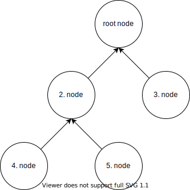
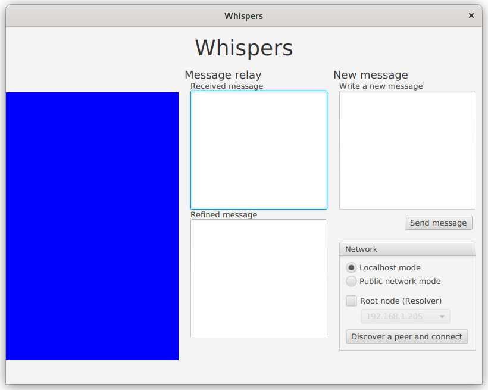
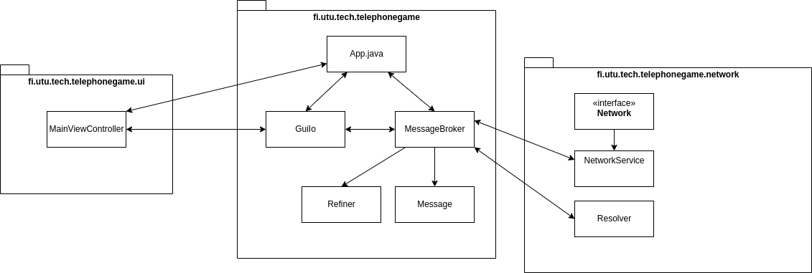

# Hajautetut ohjelmistojärjestelmät 2022 harjoitustyö: Rikkinäinen puhelin 

## Oppimistavoitteet ja tehtävärunko

Harjoitustyössä harjoitellaan verkkosovelluksen toteutusta, jolloin aihepiirit pyörivät verkon ja verkkokommunikaation ympärillä. Myös säikeitä käytetään johtuen tarpeesta hallita useaa asiakasta. Harjoitus pohjautuu valmiiseen ohjelmarunkoon, johon ryhmän tehtävänä on täydentää puuttuvat osat.

Ohjelmarunko käyttää JavaFX-kirjastoa graafisen käyttöliittymänsä toteutukseen. Harjoitustyön tekemiseen ei kuitenkaan tarvita JavaFX-osaamista, sillä graafinen ympäristö on annettu valmiina ja pääasiassa abstraktoitu pois tehtävän toteutuksesta.

Työn pohja on Maven-projekti (https://maven.apache.org/). Kurssilla ei vaadita Maven-osaamista, mutta palautettavan version on käynnistyttävä oikein komentoriviltä Mavenia käyttäen. Mikäli Maven-konfiguraatiota tai ohjelmarungon struktuuria ei muuta, ongelmia ei pitäisi ilmentyä. Ohjeet työn ajamiseen Eclipsessä ovat Moodlen puolella.

## Tehtävän aihe ja toimintaperiaate

Toisen työn aiheena on rikkinäinen puhelin. Perinteisen rikkinäisen puhelimen säännöt ovat melko selkeät: tarvitaan joukko ihmisiä jonomaisessa muodostelmassa. Jonon alkupäässä oleva henkilö keksii sanan tai lauseen. Tämä lause välitetään jonon toiseen päähän kuiskaamalla se aina seuraavan henkilön korvaan. Viesti saattaa muuttaa muotoaan matkalla joko väärintulkinnan tai jonon jäsenien mielikuvituksen vuoksi.

Tässä työssä rikkinäinen puhelin tuodaan nykyaikaan vertaisverkkopohjaisella ratkaisulla, jossa ihmiset on korvattu ohjelmilla, jotka välittävät TCP-verkkosokettien avulla toisilta saamiaan viestejä eteenpäin toisillensa. Vertaisverkolla tässä kohtaa tarkoitetaan sitä, että samassa ohjelmassa on niin palvelintoiminnallisuus, kuin asiakaspuolikin ja ennen kaikkea ohjelmat yhdistävät toisiin samanlaisiin ohjelmiin -- eli ei ole erillistä palvelinohjelmaa ja asiakasohjelmaa, vaan yhdistävä ja yhdeistettävä ohjelma ovat molemmat samoja ohjelmia, joita on vain useita samaan aikaan käynnissä. Vertaisverkossa yksittäistä verkkoon liittynyttä ohjelmainstanssia kutsutaan tämän vuoksi *vertaisiksi* (engl. peer).

## Verkon rakenne ja viestien välitys

Erona perinteiseen rikkinäiseen puhelimeen, "puhelinlinjana" **ei välttämättä** toimi yksinkertainen suora "jono", jossa jokaisella vertaisella olisi vain kaksi *naapuria*: se jolta viesti saadaan ja se, jolle se lähetetään. Naapurilla tarkoitetaan siis vertaisia, jotka ovat suoraan yhteydessä toisiinsa, eikä välillisesti jonkun toisen vertaisen kautta. Tämän tehtävän mukaisilla vertaisella **voi olla useita naapureita**: vertainen itse on luultavasti yhdistänyt johonkin toiseen vertaiseen (ellei vertainen ole ensimmäinen verkossa) ja tämän lisäksi useampi vertainen on saattanut yhdistää itsensä kyseiseen vertaiseen. Vertaisverkon rakenne määräytyy siitä, mihin vertaiseen kukin vertainen on päättänyt yhdistää. Esimerkiksi alla olevassa kuvassa on esitelty eräs vertaisverkko, jossa on kahdeksan vertaista. Mikäli tarkastellaan vertaista 7, on sillä 3 naapuria. Vertainen 7 on itse yhdistänyt vertaiseen 1 ja vertaiset 6 ja 8 ovat puolestansa yhdistäneet vertaiseen 7. Nuolet eivät kuvaa viestien kulkusuuntaa, vaan yhdistämissuuntaa (kenen asiakaskomponentti on yhdistänyt kenenkin palvelinkomponenttiin). Viestit voivat kulkea verkossa kumpaan suuntaan tahansa.

")

Viestit kulkevat vertaisverkossa siten, että viestin välittävä vertainen välittää viestin ensin omille naapureilleen, jotka puolestansa välittävät viestin omille naapureilleen jne. Lopulta kun kaikki naapurit ovat välittäneet viestin kaikille naapureilleen, viesti on propagoitunut kaikille verkossa oleville vertaisille. Toki, koska kyseessä on **rikkinäinen** puhelin, jokainen vertainen saa luvan muokata välittämäänsä viestiä haluamallaan tavalla ennen edelleenlähetystä. Esimerkiksi edellisessä kuvassa, mikäli vertainen 7 haluaisi laittaa uuden viestin liikkeelle, lähettäisi tämä viestin vertaisille 1, 6 ja 8 ja nämä vertaiset puolestansa lähettäisivät viestin (muokattuna) omille naapureillensa.

On hyvä huomata, että viesti saattaa mutatoitua eri tavoin eri suuntiin kulkiessa. Tarkkaavaisimmat saattavat myös huomata erään ongelman edelläkuvatussa viestinvälityksessä: mikäli vastaanotettu viesti edelleenlähetetään kaikille naapureille, palautuu se myös lähettäjälle itselleen, jolloin viesti lähetetään jälleen kaikille. Tästä seuraa se, että viesti saattaa jäädä kiertämään verkkoon ikuisesti. Tämän vuoksi viestien mukana tulee lähettää jokin viestin yksilöivä ID-arvo, jota vertaamalla "nähtyihin" viesteihin, voidaan estää saman viestin edelleenlähetys ja täten kummittelu verkossa.

### Yhteyden muodostus

Jotta ohjelmainstanssit voisivat yhdistää toisiinsa, täytyy vertaisten palvelinkomponentin odottaa yhdistäviä vertaisia jossakin portissa. Vastavuoroisesti vertaisten asiakaskomponentin täytyy myös osata yhdistää itsensä johonkin toiseen vertaiseen (pl. ensimmäinen vertainen, koska tällöin verkossa ei ole vielä ketään, johon yhdistää). Tätä varten tarvitaan jonkun verkossa olevan vertaisen verkko-osoite (IP-osoite) sekä portti. Nämä tiedothan olisi teoriassa mahdollista kerätä manuaalisesti jokaiselta vertaiselta. Esimerkiksi mikäli eräs vertainen IP-osoitteella `192.168.1.10` odottaisi uusia vertaisia TCP-portissa 5000, voitaisiin nämä tiedot manuaalisesti syöttää uudelle vertaiselle, jolloin vertainen voisi yhdistää em. osoitteeseen ja porttiin. Tällöin kyseisistä vertaisista tulisi naapureita. Tämä manuaalinen vertaisten "paritus" ei kuitenkaan ole tarpeen tehtäväpohjassamme, koska mukana toimitetaan erityinen "Resolver"-luokka, joka auttaa vertaisten IP-osotteiden ja porttien löytämisessä sekä määrittämisessä.

Resolverin idea on melko yksinkertainen: ensimmäinen ohjelmainstansseista pitää määrittää "juurisolmuksi" (Root node), jolloin ohjelma käynnistää Resolverin palvelinkomponentin. Tämä valinta tehdään käyttöliittymästä käyttäjän toimesta. Muiden ohjelmainstanssien resolverit käynnistetään asiakastilassa. Tällöin ne lähettävät yleislähetysviestin (broadcast), jossa tiedustelevat, onko samassa aliverkossa juurisolmua ja jos on, voisiko sen resolveri lähettää jonkin tuntemansa vertaisen IP-osoitteen ja porttinumeron, johon yhdistää. Resolverin saadessa kyseisen viestin, se antaa viestin lähettäneelle vertaiselle jonkun toisen vertaisen tiedot, sekä myös tiedon siitä, missä portissa toivoisi tiedustelun lähettäneen vertaisen kuuntelevan toisia vertaisia. Resolver-palvelin ottaa kyselyn tehneen vertaisen osoitetiedot samalla talteen, jotta voi sitten myöhemmin jakaa nämä tiedot tarvittaessa toiselle vertaiselle. Resolverin asiakaskomponentti palauttaa erityisessä `PeerConfiguration`-oliossa Resolver-palvelimeltaan saadut konfiguraatiotiedot. Olio sisältää tiedon siitä, mihin IP-osoitteeseen ja porttiin vertaisen tulisi yhdistää sekä myös toiveen siitä, missä portissa vertaisen tulisi kuunnella uusia vertaisia.

Resolver on rakennettu siten, että vertaisten yhdistäessä toisiinsa verkon ylitse sen tarjoamien IP-osotteiden perusteella, muodostavat ne toisiinsa nähden binääripuuta muistuttavan vertaisverkkorakenteen (ks. kuva). Kuten aiemmassakin esimerkissä, tässä binääripuussakin, kun jokin solmu (l. vertainen) päättää lähettää viestin, lähettää se viestin kaikille naapureilleen, jotka puolestansa muokkaavat viestiä ja lähettävät viestin eteenpäin omille naapureilleen.

Esimerkiksi yllä olevassa binääripuugraafissa, jossa vertaiset on kuvattu solmuina, mikäli 2. solmu päättäisi lähettää uuden viestin muille solmuille, lähettäisi se viestin kaikille naapureilleen: solmu 4:lle, solmu 5:lle sekä juurisolmulle (1. solmu). Juurisolmu muokkaisi viestin haluamakseen ja edelleenlähettäisi sen solmulle 3. Jos taas solmu 3 päättäisi puolestansa lähettää **uuden** viestin, lähettäisi se sen ensin ainoalle naapurillensa, juurisolmulle, joka puolestansa lähettäisi viestin (muuteltuna) 2. solmulle, joka puolestansa tekisi omat muutoksensa ja lähettäisi muutetun viestin solmuille 4 ja 5. Tällä tavoin viesti propagoituisi ympäri verkkoa solmulta toiselle aina hieman muuttuen. Huomaa, että kuvassa nuolet **eivät** edelleenkään tarkoita, mihin suuntaan viestejä lähetetään, vaan sitä, mikä solmu on yhdistänyt mihinkin solmuun (ts. asiakas -> palvelin -suhde).

Mikäli ohjelmaa ajetaan ns. localhost-tilassa, Resolver ketjuttaa vertaiset yksinkertaiseen jonomuodostelmaan binääripuun sijaan.

Tehtävää tehdessä Resolverin toiminnasta ei tarvitse erityisesti välittää -- tehtäväpohjassa on mukana tarvittavat koodirivit, jolla resolverilta saadaan tarvittavat tiedot yhdistämistä varten.

## Ohjelman käyttöliittymä ja käyttö

Käyttöliittymän vasemmassa laidassa oleva värialue kuvaa viestin etenemistä verkossa. Uuden viestin lähettäjällä ruutu muuttuu punaiseksi ja viestin edetessä verkossa, jokaisen verkon solmun värin tulisi erota edellisestä solmusta muuttuen värispektissä asteittain kohti sinistä.

Ikkunan keskimmäisen sarakkeen *received* ja *refined* tekstialueet näyttävät verkosta saapuneen viestin sisällön ennen ja jälkeen kyseisen verkon solmun tekemää muutosta. Mikäli verkkoon haluaa lähettää uuden viestin, tulisi sen onnistua *Write New Message* -kohtaan kirjoittamalla ja *Send new Message* -painiketta painamalla.

### Network-valinnat
Ennen kuin viestejä voi lähettää, vastaanottaa tai edelleenlähettää, tarvitsee ohjelma yhdistää toiseen käynnissä olevaan ohjelmaan tai vähintäänkin odottaa toisen ohjelman liittymistä: rikkinäisen puhelimen pelaaminen yksinään käy ajan mittaan tylsäksi.

Ohjelmarungossa on määritelty kaksi erilaista tilaa: *localhost mode* ja *public network mode*. Nämä vaikuttavat siihen, mitä  portti- ja osoitetietoja Resolver jakelee ja täten myös vertaisverkon rakenteeseen. Jos valintana on *localhost*, liikennöinti tapahtuu oman koneen eri porttien välillä. Tämä tila sopii testaukseen kehitettäessä ohjelmaa yhdellä koneella. Tässä tilassa resolver antaa aina edellisen Resolveriin yhdistäneen ohjelman tiedot muodostaen jonomaisen vertaisverkon. *Public network modessa* liikennöinti tapahtuu eri IP-osotteiden välillä, samaa porttia kuunnellen ja vaatii usean erillisen samassa verkossa olevan tietokoneen käyttöä. Se toimii vain yhden aliverkon alueella, eikä toimi tämän vuoksi esim. julkisen internetin yli. *Public network modessa* Reolver jakelee osoitteita siten, että vertaisverkosta muodostuu binääripuumainen rakenteeltaan.

Huom! eduroam-verkossa broadcast-viestit eivät välttämättä toimi. Localhost-moodia voi kuitenkin käyttää missä tahansa. Jos haluat kokeilla usean koneen välistä yhteyttä, kannattaa käyttää jotakin muuta verkkoa kuin eduroamia.

Network-valinnoista voi määrittää ohjelmainstanssin "juurisolmuksi" (root node), jolloin:

1. Ohjelma käynnistää Resolver-palvelinkomponentin, joka jakaa IP-osoitteet ja portit, joihin uudet vertaiset voivat yhdistää
2. Ohjelma ei yritä yhdistää mihinkään toiseen vertaiseen: juurisolmu on ensimmäinen verkkoon liittyvä vertainen, eikä se voi täten yhdistää kehenkään muuhun
3. Ohjelma käynnistää oman palvelinkomponenttinsa odottamaan vertaisia ohjelmaan kovakoodatussa oletusportissa

Mikäli puolestaan ohjelmaa **ei** määritetä juurisolmuna:

1. Ohjelma lähettää ensin vertaistenhakupyynnön (`resolver.resolve()`) ja odottaa, että jokin käynnissä oleva juurisolmu vastaisi siihen
2. Juurisolmu vastaa lähettämällä jonkin vertaisen tiedot, sekä toiveen siitä, mitä porttia nyt yhdistävän vertaisen pitäisi kuunnella
3. Vertaisemme yhdistää toiseen vertaiseen juurisolmun antamilla tiedoilla ja käynnistää palvelinkomponenttinsa toivotussa portissa

Resolverin toiminnallisuus on mukana tehtäväpohjassa, eikä sitä siis tarvitse itse implementoida. Kun testaatte ohjelmaanne, yhden (ja vain yhden) ohjelmainstanssin täytyy toimia juurisolmuna, loput ohjelmainstanssit pyytävät juurisolmun resolverilta tarvittavat tiedot ja yhdistävät sen perusteella saatuun osoitteeseen. Juurisolmua luodessa pitää alasvetovalikosta *public network modessa* valita myös IP-osoite, josta koneesi on tavoitettavissa.

### Testaus ja käyttö

Ohjelmasta käynnistetään samanaikaisesti useita instansseja joko samaan koneeseen käyttäen *localhost*-moodia tai useampaan koneeseen *public network* -moodissa. **Vain yksi ohjelmainstansseista asetaan juurisolmuksi**, eli root node -tilaan. Verkko käynnistään painamalla *Start waiting for others* -nappia. Tällöin (valmiin) ohjelman tulisi alkaa odottamaan, että toiset vertaiset yhdistävät tähän.

Juurisolmun käynnistämisen jälkeen muut käynnissä olevat ohjelmat voidaan yhdistää verkkoon "Discover peer and connect"-nappia painamalla. Resolverin ansiosta käyttäjän ei tarvitse tietää, mihin vertaiseen hänen pitää yhdistää: Resolver antaa IP-osoitteen ja portin, johon ohjelma voi yhdistää. Koska kyseessä on vertaisverkko-ohjelmisto, täytyy myös jokaisen yhdistäneen vertaisen kuunnella yhteyspyyntöjä toisilta vertaisilta Resolverin ehdottamassa portissa.

## Ohjelman rakenteen kuvaus

### App.java ja fi.utu.tech.telephonegame.ui pakkaus

App.java on ohjelman pääluokka, joka sisältää main-metodin, sekä joidenkin palveluiden käynnistyksen. Pakkaus UI sisältää graafiseen käyttöliitymän toimintaan liittyvät luokat.

Näitä luokkia ei harjoitustyössä saa muuttaa, eikä niitä käytetä työssä suoraan, jolloin niiden sisältöä ei tarvitse ymmärtää. Oletamme, että kurssia käyvillä ei ole kokemusta käyttöliittymäohjelmoinnista.

### GuiIO.java

GuiIo on linkki JavaFx-käyttöliittymän ja ohjelman muiden osien välillä. Tätä luokkaa ei pidä muuttaa, mutta sen kautta ohjelman käyttöliittymää voidaan päivittää tehtävänannon kannalta tarvittavin osin.

### Refiner.java

Refiner-luokassa on metodit, joihin voidaan määrittää, miten vastaanotettujen viestien tekstisisältöä voidaan muuttaa ennen edelleenlähetystä. Voit keksiä omia muuntofuktioitasi vapaasti, kunhan ne noudattavat hyvää makua.

### Message.java

Sisältää välitettävän viestin, sekä viestin "värin", sekä metodit näiden muokkaamiseksi. Jokaisella viestillä on myös oma ID-tunnisteensa. Message-luokan olioita käytetään "kuiskausten" välittämiseen verkon yli. Huomaa, että Message-luokka implementoi Serializable-rajapinnan!

Vinkki: Messagen ID:tä pystyy käyttämään edelleenlähetyksen estoon: mikäli samalla id-tunnisteella merkattu viesti vastaanotetaan uudelleen, sen voinee heittää roskiin...

### MessageBroker.java
MessageBrokerin, eli viestinvälittäjän tarkoituksena on välittää verkkoluokan (Network) vastaanottamat Message-oliot ohjelman eri komponenteille, kuten käyttöliittymälle, Refinerille, sekä Refireniltä saadut, muokatut viestit, takaisin verkkokomponentille edelleenlähetettäviksi.

### fi.utu.tech.telephonegame.network -pakkaus
Tämä pakkaus sisältää kaiken verkkoon liittyvän toiminnallisuuden. Suuri osa työstä tehdään tämän pakkauksen alle.

### Resolver
Resolver-luokkaa voidaan pitää solmujen "treffipalveluna", sillä se hoitaa uusien solmujen sovittamisen verkkoon siten, että muodostuva verkkorakenne muistuttaa binääripuuta. Vaikka resolverin toimintaa on jo aiemminkin käsitelty, kerrataan se vielä. Toiminta yksinkertaistetusti on seuraavanlainen: Vertaisen ollessa juurisolmu, käynnistetään Resolver-luokasta palvelinsäie, joka kuuntelee vertaishakupyyntöjä, joita muut vertaiset kuin juurisolmu, pystyvät tekemään samaisen luokan `resolve()`-metodilla. Kommunikaatio tapahtuu UDP-soketeilla broadcast-osoitteeseen, joten juurisolmua etsivän solmun ei tarvitse tietää juurisolmun tarkkaa IP-osoitetta. Juurisolmu vastaa uudelle säikeelle antamalla tälle jonkun verkossa olevan vertaisen IP-osoitteen ja portin, johon vertainen voi itsensä yhdistää (samalla taaten binääripuumaisen rakenteen verkolle). Samaisessa viestissä välitetään myös toive siitä, missä portissa uuden vertaisen tulisi kuunnella toisia vertaisia. Resolver-palvelin nappaa resolvausta pyytäneen vertaisen IP-osoitteen sekä porttitoiveen talteen, jotta voi tulevaisuudessa antaa nämä jollekin toiselle solmulle yhdistämiskohteeksi.

Kurssin aiheiden kannalta on hyvä tutustua siihen, miten resolver toimii, mutta sen sisäisen logiikan ymmärtäminen ei ole keskeistä harjoitustyön tekemiseksi. Oleellista on ymmärtää, että luodakseen TCP-yhteyden johonkin vertaiseen, täytyy sen IP-osoite selvitää. Resolver on luotu tätä tarkoitusta varten. MessageBrokerin `connect`-metodissa on valmiina logiikka siihen, milloin resolveria käytetään palvelinmoodissa ja milloin asiakasmoodissa. Kyseinen metodi myös osaa kutsua NetworkServicen (kuvattu alla) oikeita metodeita oikeilla argumenteilla.

Resolveriin ei tule tehdä muutoksia.

### NetworkService

NetworkService toteuttaa samassa pakkauksessa sijaitsevan Network-rajapinnan. Näillä metodeilla voisi esimerkiksi alkaa kuuntelemaan vertaisien yhteydenottopyyntöjä (ei siis Resolverin pyyntöjä, niistä ei tarvitse NetworkServicessä välittää), yhdistää toiseen vertaiseen tai lähettää viestejä vertaisille, joihin on jo yhdistetty. Sanomattakin selvää, että tämän luokan kirjoittaminen on suuri osa työn suoritusta. Lisävinkkinä, `fi.utu.tech.telephonegame.network`-pakkaukseen tarvitsee luultavasti kirjoittaa myös uusia luokkia.

## Tehtävän vaatimukset
- Toteuttakaa ohjelmaan verkkotoiminnallisuus
	- Vertaisen tulee pystyä yhdistämään toiseen vertaiseen (asiakaskomponentti)
	- Vertaisen tulee myös ottaa useita yhteydenottoja vastaan (säikeistetty palvelinkomponentti) 
	- Tulee osata lähettää ja vastaanottaa Message-olioita naapureilta ja naapureille (eli siis niille, jotka ovat vertaiseen suoraan yhdistäneet, sekä sille, johon vertainen on itse yhdistänyt)
	- Käyttäkää TCP-soketteja, sekä ObjectOutputStreamia ja ObjectInputStreamia (Serializable-rajapinta)
	- Muutokset tehdään NetworkService-luokkaan, sekä omiin tarpeellisiksi näkemiinne uusiin luokkiin
- Toteuttakaa MessageBrokerin metodit, jolla saatte Network-komponenttinne verkosta vastaanottamat oliot MessageBrokerin puolelle ja käsitelkää vastaanotetut Message-oliot siten, että
	1) Viesti ja väri muokataan Refinerissä
	2) Vastaanotettu viesti sekä muokattu viesti ja väri näkyvät käyttöliittymässä
	3) Muokattu viesti lähetetään kaikille naapureille
		- Kerran lähetettyä viestiä ei käsitellä enää uudelleen, eikä lähetetä edelleen
- Toteuttakaa Refiner-luokan viestinmuutosmetodi mutatoimaan viestien tekstisisältöä
	- Mukana yksi esimerkki, mutta keksikää jokin oma tilalle
	- Mielikuvitusta saa käyttää! Huomatkaa, että tarkoitus on muokata Message-olion viestisisältöä, ei luoda uutta Message-oliota
- Ohjelman ei tarvitse osata toipua tilanteesta, jossa jokin vertaisista tippuu pois välistä
